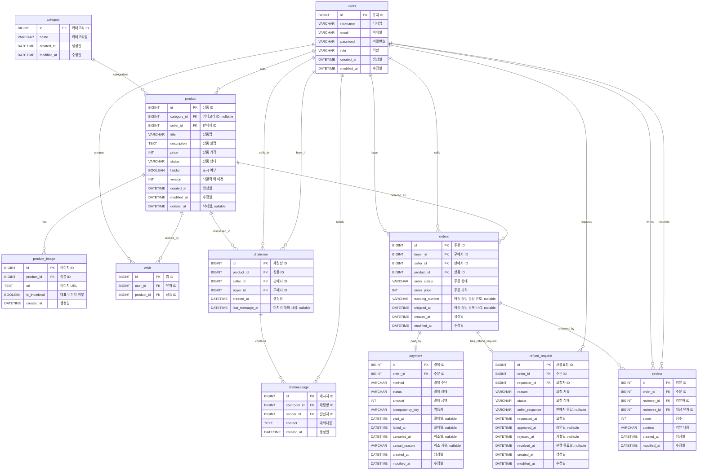

# ERD

열무마켓의 ERD를 이미지 기준으로 정리한 문서입니다.

카테고리, 찜, 결제, 환불 요청, 리뷰는 PRD 기준 P1/P2 범위까지 포함합니다. 상태값은 PRD의 상품/주문 상태와 1:1 중고거래 중개 플랫폼 정책을 기준으로 정의했습니다.

검색 성능 개선, 인기 검색어 집계, access token 로그아웃 블랙리스트, 활성 refresh token은 Redis를 기준으로 관리하므로 이 관계형 ERD에는 포함하지 않습니다.
Redis 검색 캐시 결정은 `docs/adr/002-redis-search-cache.md`, JWT 폐기와 refresh token 회전 결정은 `docs/adr/007-jwt-refresh-token-rotation.md`를 따릅니다.

## 관계도

## 테이블 정의

### category

| 논리명 | 컬럼명 | 타입 | NULL | 제약/비고 |
| --- | --- | --- | --- | --- |
| 카테고리 ID | id | BIGINT | NOT NULL | PK |
| 카테고리명 | name | VARCHAR(20) | NOT NULL | UNIQUE |
| 생성일 | created_at | DATETIME | NOT NULL | |
| 수정일 | modified_at | DATETIME | NOT NULL | |

### product

| 논리명 | 컬럼명 | 타입 | NULL | 제약/비고 |
| --- | --- | --- | --- | --- |
| 상품 ID | id | BIGINT | NOT NULL | PK |
| 카테고리 ID | category_id | BIGINT | NULL | FK: category.id. 카테고리는 P1 범위라 미분류 상품 허용 |
| 판매자 ID | seller_id | BIGINT | NOT NULL | FK: users.id |
| 상품명 | title | VARCHAR(100) | NOT NULL | |
| 상품 설명 | description | TEXT | NOT NULL | |
| 상품 가격 | price | INT | NOT NULL | 0보다 커야 함 |
| 상품 상태 | status | VARCHAR(20) | NOT NULL | ON_SALE, RESERVED, SOLD_OUT, DELETED |
| 표시 여부 | hidden | BOOLEAN | NOT NULL | true이면 일반 사용자에게 노출하지 않음 |
| 버전 | version | INT | NOT NULL | 기본값 0. JPA 낙관적 락(@Version). 동시 주문 충돌 감지 |
| 생성일 | created_at | DATETIME | NOT NULL | |
| 수정일 | modified_at | DATETIME | NOT NULL | |
| 삭제일 | deleted_at | DATETIME | NULL | 소프트 삭제 시각 |

### product_image

상품 이미지는 P1 범위입니다. 한 상품에 여러 이미지를 등록할 수 있고, 대표 이미지는 `is_thumbnail`로 표시합니다.

제약 조건:

- 상품당 대표 이미지는 1개만 허용

| 논리명 | 컬럼명 | 타입 | NULL | 제약/비고 |
| --- | --- | --- | --- | --- |
| 이미지 ID | id | BIGINT | NOT NULL | PK |
| 상품 ID | product_id | BIGINT | NOT NULL | FK: product.id |
| 이미지 URL | url | TEXT | NOT NULL | |
| 대표 이미지 여부 | is_thumbnail | BOOLEAN | NOT NULL | 상품당 대표 이미지는 1개만 허용 |
| 생성일 | created_at | DATETIME | NOT NULL | 업로드 시각 |

### users

| 논리명 | 컬럼명 | 타입 | NULL | 제약/비고 |
| --- | --- | --- | --- | --- |
| 유저 ID | id | BIGINT | NOT NULL | PK |
| 닉네임 | nickname | VARCHAR(30) | NOT NULL | |
| 이메일 | email | VARCHAR(255) | NOT NULL | UNIQUE |
| 비밀번호 | password | VARCHAR(255) | NOT NULL | 해시 저장 |
| 역할 | role | VARCHAR(10) | NOT NULL | USER, ADMIN |
| 생성일 | created_at | DATETIME | NOT NULL | |
| 수정일 | modified_at | DATETIME | NOT NULL | |

### wish

제약 조건:

- `UNIQUE (user_id, product_id)`

| 논리명 | 컬럼명 | 타입 | NULL | 제약/비고 |
| --- | --- | --- | --- | --- |
| 찜 ID | id | BIGINT | NOT NULL | PK |
| 유저 ID | user_id | BIGINT | NOT NULL | FK: users.id |
| 상품 ID | product_id | BIGINT | NOT NULL | FK: product.id |

같은 사용자는 같은 상품을 한 번만 찜할 수 있습니다.

### chatroom

제약 조건:

- `UNIQUE (product_id, buyer_id, seller_id)`

| 논리명 | 컬럼명 | 타입 | NULL | 제약/비고 |
| --- | --- | --- | --- | --- |
| 채팅방 ID | id | BIGINT | NOT NULL | PK |
| 상품 ID | product_id | BIGINT | NOT NULL | FK: product.id |
| 판매자 ID | seller_id | BIGINT | NOT NULL | FK: users.id |
| 구매자 ID | buyer_id | BIGINT | NOT NULL | FK: users.id |
| 생성일 | created_at | DATETIME | NOT NULL | |
| 마지막 대화 시점 | last_message_at | DATETIME | NULL | 메시지 생성 시 갱신 |

동일 상품에 대해 같은 구매자와 판매자 사이의 채팅방은 하나만 유지합니다.

### chatmessage

| 논리명 | 컬럼명 | 타입 | NULL | 제약/비고 |
| --- | --- | --- | --- | --- |
| 메시지 ID | id | BIGINT | NOT NULL | PK |
| 채팅방 ID | chatroom_id | BIGINT | NOT NULL | FK: chatroom.id |
| 발신자 ID | sender_id | BIGINT | NOT NULL | FK: users.id. 채팅방 참여자만 허용 |
| 대화내용 | content | TEXT | NOT NULL | 빈 메시지 불가 |
| 생성일 | created_at | DATETIME | NOT NULL | |

### orders

| 논리명 | 컬럼명 | 타입 | NULL | 제약/비고 |
| --- | --- | --- | --- | --- |
| 주문 ID | id | BIGINT | NOT NULL | PK |
| 구매자 ID | buyer_id | BIGINT | NOT NULL | FK: users.id |
| 판매자 ID | seller_id | BIGINT | NOT NULL | FK: users.id |
| 상품 ID | product_id | BIGINT | NOT NULL | FK: product.id |
| 주문 상태 | order_status | VARCHAR(20) | NOT NULL | CREATED, PAID, SHIPPING, COMPLETED, CANCELED, REFUND_REQUESTED, REFUNDED, DISPUTED |
| 주문 가격 | order_price | INT | NOT NULL | 주문 생성 시점의 상품 가격 스냅샷 |
| 배송 증빙 송장 번호 | tracking_number | VARCHAR(100) | NULL | P1 배송 증빙 |
| 배송 증빙 등록 시각 | shipped_at | DATETIME | NULL | 판매자가 배송 증빙을 등록한 시각 |
| 생성일 | created_at | DATETIME | NOT NULL | |
| 수정일 | modified_at | DATETIME | NOT NULL | |

P0 주문이 성공하면 상품은 `RESERVED`가 됩니다. 동일 상품에는 동시에 여러 주문 시도가 가능하지만 성공 주문은 하나만 허용합니다.
`product_id`에 단순 `UNIQUE` 제약을 두지 않고, 상품 상태 전이와 `product.version` 낙관적 락으로 성공 주문 중복을 막습니다.
주문 취소 사유와 주문 취소 전용 시각은 `orders`에 저장하지 않습니다. 결제 취소 사유는 `payment.cancel_reason`에서 별도로 다룹니다.

### payment

제약 조건:

- `UNIQUE (order_id)`
- `UNIQUE (idempotency_key)`

| 논리명 | 컬럼명 | 타입 | NULL | 제약/비고 |
| --- | --- | --- | --- | --- |
| 결제 ID | id | BIGINT | NOT NULL | PK |
| 주문 ID | order_id | BIGINT | NOT NULL | FK: orders.id, UNIQUE |
| 결제 수단 | method | VARCHAR(30) | NOT NULL | 예: MOCK_CARD |
| 결제 상태 | status | VARCHAR(20) | NOT NULL | PENDING, PAID, FAILED, CANCELED, REFUNDED |
| 결제 금액 | amount | INT | NOT NULL | 주문 가격과 일치해야 함 |
| 멱등키 | idempotency_key | VARCHAR(100) | NOT NULL | UNIQUE. 중복 결제 방지 |
| 결제일 | paid_at | DATETIME | NULL | 결제 성공 시각 |
| 실패일 | failed_at | DATETIME | NULL | 결제 실패 시각 |
| 취소일 | canceled_at | DATETIME | NULL | 결제 취소 또는 환불 처리 시각 |
| 취소 사유 | cancel_reason | VARCHAR(255) | NULL | 결제 취소 요청 사유. API 응답에는 노출하지 않음 |
| 생성일 | created_at | DATETIME | NOT NULL | |
| 수정일 | modified_at | DATETIME | NOT NULL | |

하나의 주문에는 결제 row를 최대 1건만 연결합니다. P1 모의 결제에서 성공, 실패, 취소를 시뮬레이션합니다.
실제 결제대금 보관, 에스크로, 판매자 송금, 수수료는 이 프로젝트 범위에 포함하지 않습니다.

### refund_request

환불 요청은 P2 범위입니다. 배송 증빙 등록 후 구매자가 거래를 취소하려면 단순 취소가 아니라 환불 요청을 생성합니다.

제약 조건:

- `UNIQUE (order_id)`

| 논리명 | 컬럼명 | 타입 | NULL | 제약/비고 |
| --- | --- | --- | --- | --- |
| 환불요청 ID | id | BIGINT | NOT NULL | PK |
| 주문 ID | order_id | BIGINT | NOT NULL | FK: orders.id, UNIQUE |
| 요청자 ID | requester_id | BIGINT | NOT NULL | FK: users.id. 구매자 |
| 요청 사유 | reason | VARCHAR(255) | NOT NULL | |
| 요청 상태 | status | VARCHAR(20) | NOT NULL | REQUESTED, APPROVED, DISPUTED, CLOSED |
| 판매자 응답 | seller_response | VARCHAR(255) | NULL | 승인/거절 사유 |
| 요청일 | requested_at | DATETIME | NOT NULL | |
| 승인일 | approved_at | DATETIME | NULL | 판매자가 환불 요청을 승인한 시각 |
| 거절일 | rejected_at | DATETIME | NULL | 판매자가 환불 요청을 거절해 분쟁으로 전환한 시각 |
| 분쟁 종료일 | resolved_at | DATETIME | NULL | 분쟁을 환불 또는 거래 완료로 종료한 시각 |
| 생성일 | created_at | DATETIME | NOT NULL | |
| 수정일 | modified_at | DATETIME | NOT NULL | |

한 주문에는 환불 요청을 최대 1건만 연결합니다. 부분 환불과 법적 분쟁 중재는 P2 범위에서도 구현하지 않습니다.
환불 요청 승인 또는 분쟁의 환불 종료 시 상품 상태는 별도 반품 확인 없이 `ON_SALE`로 자동 전환합니다.
판매자가 환불 요청을 거절하면 별도 거절 상태를 저장하지 않고 `DISPUTED` 상태로 전환합니다.

### review

리뷰는 P2 범위입니다. 거래 완료된 주문에서 구매자와 판매자는 같은 주문의 상대방에게 각각 한 번씩 리뷰할 수 있습니다.

제약 조건:

- `UNIQUE (order_id, reviewer_id)`

| 논리명 | 컬럼명 | 타입 | NULL | 제약/비고 |
| --- | --- | --- | --- | --- |
| 리뷰 ID | id | BIGINT | NOT NULL | PK |
| 주문 ID | order_id | BIGINT | NOT NULL | FK: orders.id |
| 리뷰어 ID | reviewer_id | BIGINT | NOT NULL | FK: users.id. 주문 구매자 또는 판매자 |
| 대상 유저 ID | reviewee_id | BIGINT | NOT NULL | FK: users.id. 같은 주문의 상대방 |
| 점수 | score | INT | NOT NULL | 1~5 |
| 리뷰 내용 | content | VARCHAR(255) | NOT NULL | |
| 생성일 | created_at | DATETIME | NOT NULL | |
| 수정일 | modified_at | DATETIME | NOT NULL | |

`reviewer_id`와 `reviewee_id`는 같은 주문의 참여자여야 하며 서로 달라야 합니다.

## 상태값 정의

### 상품 상태

| 상태 | 의미 |
| --- | --- |
| ON_SALE | 판매 중. 주문 가능한 상태 |
| RESERVED | 예약 중. 주문이 생성되어 다른 사용자가 주문할 수 없는 상태 |
| SOLD_OUT | 판매 완료. 구매확정으로 거래가 완료된 상태 |
| DELETED | 삭제. 판매자가 삭제한 상태 |

상품 노출 여부는 `product.hidden`으로 관리합니다. `hidden = true`이면 일반 사용자에게 노출하지 않습니다.

### 주문 상태

| 상태 | 의미 |
| --- | --- |
| CREATED | 주문이 생성되고 상품이 예약된 상태 |
| PAID | 결제가 완료된 상태 |
| SHIPPING | 판매자가 배송 증빙을 등록한 상태 |
| COMPLETED | 구매확정으로 거래가 완료되고 판매자 지급 가능 상태가 된 상태 |
| CANCELED | 판매자가 보내기 전 거래를 없던 일로 돌린 상태 |
| REFUND_REQUESTED | 판매자가 보낸 뒤 구매자가 환불을 요청한 상태 |
| REFUNDED | P1 배송 전 결제 후 취소, P2 환불 요청 승인, 또는 분쟁의 환불 종료로 환불된 상태 |
| DISPUTED | 환불 요청에 대해 구매자와 판매자가 합의하지 못한 상태 |

P0에서는 `CREATED`, `CANCELED`만 사용합니다.
P1에서는 `PAID`, `SHIPPING`, `COMPLETED`, `REFUNDED`를 모의 안전결제와 배송 증빙 흐름에서 사용합니다.
P2에서는 `REFUND_REQUESTED`, `DISPUTED`를 환불 요청과 분쟁 흐름에서 사용합니다.

### 결제 상태

| 상태 | 의미 |
| --- | --- |
| PENDING | 결제 요청이 생성되었지만 아직 성공/실패가 확정되지 않은 상태 |
| PAID | 결제가 성공한 상태 |
| FAILED | 결제가 실패한 상태 |
| CANCELED | 결제 전 또는 결제 승인 전 취소된 상태 |
| REFUNDED | 결제 후 환불된 상태 |

### 환불 요청 상태

| 상태 | 의미 |
| --- | --- |
| REQUESTED | 구매자가 환불을 요청한 상태 |
| APPROVED | 판매자가 환불 요청을 승인한 상태 |
| DISPUTED | 판매자가 환불 요청을 거절해 분쟁으로 전환된 상태 |
| CLOSED | 환불 또는 거래 완료로 요청 처리가 종료된 상태 |

환불 요청 상태 흐름은 `REQUESTED -> APPROVED`, `REQUESTED -> DISPUTED`, `DISPUTED -> CLOSED`만 허용합니다.

## 관계 요약

| 관계 | 설명 |
| --- | --- |
| category - product | 카테고리는 여러 상품을 분류할 수 있다. 상품의 카테고리는 P1 전까지 비어 있을 수 있다. |
| user - product | 유저는 여러 상품을 판매자로 등록할 수 있다. |
| product - product_image | 상품은 여러 이미지를 가진다. 대표 이미지는 is_thumbnail로 표시한다. |
| user - wish | 유저는 여러 상품을 찜할 수 있다. |
| product - wish | 상품은 여러 유저에게 찜될 수 있다. |
| product - chatroom | 상품은 여러 구매 희망자와의 채팅방을 가질 수 있다. |
| user - chatroom | 유저는 판매자 또는 구매자로 채팅방에 참여한다. |
| chatroom - chatmessage | 채팅방은 여러 메시지를 가진다. |
| user - chatmessage | 유저는 채팅 메시지를 보낼 수 있다. |
| user - order | 유저는 구매자 또는 판매자로 주문에 참여한다. |
| product - order | 상품은 주문으로 거래된다. 성공 주문은 상품별로 하나만 허용한다. |
| order - payment | 주문은 최대 하나의 결제와 연결된다. |
| order - refund_request | 주문은 최대 하나의 환불 요청과 연결된다. |
| user - refund_request | 구매자는 배송 증빙 등록 후 환불 요청을 생성할 수 있다. |
| order - review | 주문은 구매자 리뷰와 판매자 리뷰를 가질 수 있다. |
| user - review | 유저는 리뷰를 작성하고 같은 주문의 상대방에게 리뷰를 받을 수 있다. |
